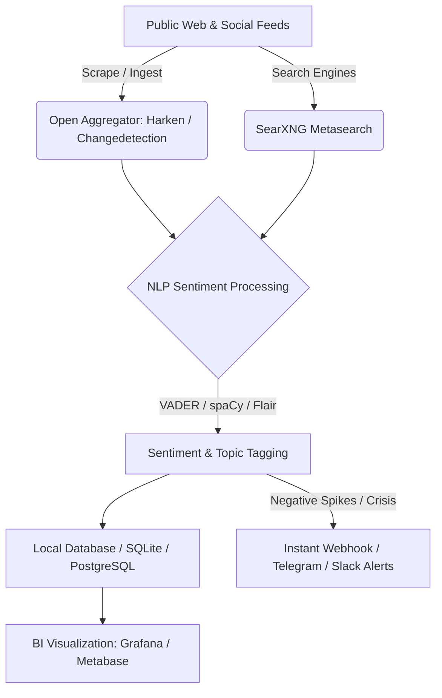

# 🌟 Awesome Online Reputation Management (ORM) 🛡️

**A curated index of top Online Reputation Management (ORM) SaaS platforms, AI social listening tools, brand monitoring software, sentiment analysis engines, and self-hosted open-source frameworks.**

*Monitor customer reviews, track brand mentions, analyze sentiment polarity, protect brand identity, automate response workflows, and audit local business listings.*

📅 **Last updated: August 2026**

---

## 📖 Table of Contents

- [📊 Sector Overview & Market Size](#-sector-overview--market-size)
- [🏢 SaaS & Hosted Platforms](#-saashosted-platforms)
- [💻 Open-Source GitHub Projects](#-open-source-github-projects)
- [🛠️ Architectural Blueprints & Frameworks](#️-architectural-blueprints--frameworks)
- [📈 Star History](#-star-history)
- [🤝 How to Contribute](#-how-to-contribute)
- [⚖️ Disclaimer](#-disclaimer)

---

## 📊 Sector Overview & Market Size

> 💡 **Market Size & Landscape:** The global **Online Reputation Management (ORM) market** is valued at approximately **$7.75 Billion in 2026** and is projected to reach **$14.01 Billion by 2031 (12.6% CAGR)**, characterized by **moderate fragmentation** where enterprise market leaders co-exist with specialized local review platforms and vertical-specific monitoring solutions rather than a pure winner-take-all monopoly.

---

## 🏢 SaaS/Hosted Platforms

*Sorted in descending order by estimated company scale, revenue, and enterprise valuation.*

| Platform | Valuation / Revenue Scale | Description | Pricing | Free Tier / Trial Limit |
| :--- | :--- | :--- | :--- | :--- |
| **[Podium](https://www.podium.com/)** | **~$3.0B Valuation** (~$220M–$389M Est. Revenue) | Messaging and reputation platform for local businesses to automate review requests, text marketing, and customer communication. | Starts at ~$399/mo (Core plan) and ~$599/mo (Pro plan) with annual contract; custom enterprise tiers available. | 14 to 30-day free trial available via select partner promotions; guided sales demo available. |
| **[Yext](https://www.yext.com/)** | **~$630M Market Cap** (~$445M TTM Revenue, NYSE: YEXT) | Knowledge and listings management platform keeping business information accurate across directories and managing reviews. | Starts at ~$199/yr (~$4/week base tier) up to ~$999/yr for premium plans; enterprise tiers quote-based. | No ongoing free plan; provides a free business listings scan tool & guided demo upon request. |
| **[Brandwatch](https://www.brandwatch.com/)** | **~$450M Acquisition** (~$120M–$221M Est. Revenue, Cision) | Consumer intelligence and enterprise social listening platform providing deep sentiment analytics and trend tracking. | Starts at ~$800/mo (custom annual contract based on mention volume, query limits, and user seats). | No public self-serve free plan; live evaluation and tailored proof-of-concept demo via sales consultation. |
| **[Reputation.com](https://www.reputation.com/)** | **~$330M+ Valuation** (~$100M+ ARR) | Enterprise reputation & customer experience platform unifying reviews, surveys, and multi-location analytics. | Starts at ~$80/location/mo (Rep Core); Rep Core + Pulse at ~$115/location/mo; Rep Core + Surveys at ~$150/location/mo (annual contract). | No free plan; interactive demo & free online reputation readiness check available upon request. |
| **[Birdeye](https://birdeye.com/)** | **~$100M+ ARR** ($93M Total Funding) | All-in-one reputation and customer experience platform covering reviews, listings, messaging, surveys, and AI response workflows. | Starts at ~$299/mo (custom quote based on location count & add-on modules). | 30-day free trial for Birdeye Social module; free Local SEO audit tool (full platform access requires demo). |
| **[Meltwater](https://www.meltwater.com/)** | **~$439M+ Annual Revenue** ($175M Total Funding) | Enterprise media intelligence and social listening suite for PR, brand perception, and competitive analysis at scale. | Starts at ~$6,000 – $10,000/year base tier depending on data volume, seats, and modules. | No public self-serve free plan; customized human-guided product walkthrough demo on request. |
| **[Brand24](https://brand24.com/)** | **~$35M+ PLN Acquisition** (~$9M+ ARR, Semrush) | AI-powered media and social monitoring platform tracking online mentions, sentiment score, and reviews across the web. | Starts at $199/mo billed annually ($249/mo month-to-month for Individual: 3 keywords, 2,000 mentions/mo, 1 user); Team plan at $299/mo. | 14-day free trial with full feature access (capped at 100 mentions/day from X/Twitter & Instagram; no credit card required). |
| **[Talkwalker](https://www.talkwalker.com/)** | **~$25M+ ARR** (Acquired by Hootsuite) | AI-powered social listening and media monitoring suite for tracking brand health, crisis detection, and sentiment. | Starts at ~$9,600/year (~$800/mo base tier) scaling by data consumption, languages, and topic quotas. | No free forever plan; tailored demo and evaluation trial available via sales consultation. |
| **[Mention](https://mention.com/)** | **~$10M+ Est. Revenue** (Part of Agorapulse Group) | Brand monitoring and social listening platform for tracking keywords, audience engagement, and competitive benchmarking. | Starts at $599/mo billed annually (Company plan: 5 alerts, 50,000 mentions/mo, unlimited users). | 14-day free trial with core monitoring features (no credit card required; guided demo available). |
| **[Determ](https://www.determ.com/)** | **~$3.5M Total Funding** (Scale-up) | Media monitoring and reputation tool delivering real-time keyword tracking, sentiment analysis, and alert workflows. | Starts at €99/mo (Focus tier: 1 topic); Expand tier at €299/mo (5 topics); Command tier at €499/mo (10 topics). | 5-day full-feature free trial (expandable to 14 days upon request with demo; no credit card required). |
| **[More Good Reviews](https://moregoodreviews.com/)** | **Bootstrapped** (founded 2022, NYC) | AI reputation manager for local service businesses and agencies: automated email/SMS review requests, branded review pages, Google & Facebook sync and AI replies, widgets, white-label Agency plan, plus MCP/API automation. | Starts at ~$59/location/mo (Business; yearly ~$49/mo equiv.); Agency ~$99/mo with 5 locations | No free-forever plan; demo available at https://cal.com/moregoodreviews/demo. |

---

## 💻 Open-Source GitHub Projects

*Self-hosted tools, natural language processing libraries, web scrapers, and alerting frameworks for building private, privacy-conscious ORM pipelines. Sorted in descending order by GitHub Stars.*

| Repository | Github_Stars | Description | Category |
| :--- | :--- | :--- | :--- |
| **[searxng/searxng](https://github.com/searxng/searxng)** |  | Privacy-respecting, metasearch engine aggregating results from over 70 search engines for brand intelligence. | Search & Web Discovery |
| **[explosion/spaCy](https://github.com/explosion/spaCy)** |  | Industrial-strength NLP in Python for named entity recognition (NER), entity linking, and sentiment analysis. | Sentiment & NLP Engine |
| **[dgtlmoon/changedetection.io](https://github.com/dgtlmoon/changedetection.io)** |  | Self-hosted web page change monitoring and notification tool for tracking review sites and brand mentions. | Web Monitoring & Alerts |
| **[ArchiveBox/ArchiveBox](https://github.com/ArchiveBox/ArchiveBox)** |  | Open-source self-hosted web archiving solution to preserve evidentiary snapshots of public mentions and reviews. | Evidence Preservation |
| **[twintproject/twint](https://github.com/twintproject/twint)** |  | Advanced Twitter scraping tool written in Python that allows scraping Tweets without Twitter's API limits. | Social Media Scraping |
| **[nltk/nltk](https://github.com/nltk/nltk)** |  | Comprehensive Natural Language Toolkit for text processing, tokenization, sentiment analysis, and classification. | NLP & Text Mining |
| **[flairNLP/flair](https://github.com/flairNLP/flair)** |  | Powerful PyTorch NLP framework for state-of-the-art multilingual sentiment analysis and entity recognition. | Deep Learning Sentiment |
| **[sloria/TextBlob](https://github.com/sloria/TextBlob)** |  | Simplified Pythonic library for processing textual data and extracting polarity/subjectivity sentiment scores. | Sentiment Analysis |
| **[stanfordnlp/stanza](https://github.com/stanfordnlp/stanza)** |  | Stanford Official Python NLP toolkit for multilingual text analytics, dependency parsing, and sentiment extraction. | Multilingual NLP |
| **[cjhutto/vaderSentiment](https://github.com/cjhutto/vaderSentiment)** |  | Rule-based sentiment analysis tool specifically attuned to social media sentiments and microblog text. | Social Sentiment Scoring |
| **[feedbin/feedbin](https://github.com/feedbin/feedbin)** |  | Web-based RSS and media aggregator for centralizing real-time news alerts, press mentions, and blog coverage. | RSS Feed Monitoring |
| **[boy-jer/apphera](https://github.com/boy-jer/apphera)** |  | Open-source internet and social media monitoring platform covering reviews, competitor analysis, and keywords. | Review & Social Suite |
| **[VladUZH/harken](https://github.com/VladUZH/harken)** |  | Self-hosted social listening tool that tracks mentions across Reddit, Hacker News, Mastodon, Bluesky, and RSS. | Self-Hosted Social Listening |
| **[HasData/social-listening-tool](https://github.com/HasData/social-listening-tool)** |  | Automated Python-based social listening pipeline capturing mentions across Instagram, TikTok, Reddit, and X. | Cross-Platform Listener |
| **[brightdata/brand-reputation-monitor](https://github.com/brightdata/brand-reputation-monitor)** |  | Workflow for monitoring Google News brand mentions, running OpenAI sentiment analysis, and generating alerts. | AI News & Reputation Agent |

---

## 🛠️ Architectural Blueprints & Frameworks

- **Data Ownership**: Deploying self-hosted listeners (**Harken**, **Changedetection.io**) with local NLP (**spaCy**, **VADER**) ensures 100% data sovereignty without recurring per-seat fees.
- **Enterprise SaaS Hybrid**: Combining self-hosted listening with commercial review suites (**Birdeye**, **Podium**, **Reputation**) provides complete coverage over verified customer review networks (Google Maps, Yelp, G2, Trustpilot).

---

## 📈 Star History

---

## 🤝 How to Contribute

1. 🍴 Fork the repository.
2. ✍️ Add or update entries in `README.md` following the tabular schema.
3. 🔗 Include verified links, accurate pricing/star data, and clear descriptions.
4. 🚀 Submit a Pull Request with details about your addition.

---

## ⚖️ Disclaimer

- This list is **community-curated** for educational, architectural, and evaluation purposes.
- Online reputation management entails public data and customer feedback. Always adhere to target platform Terms of Service, privacy regulations (GDPR/CCPA), and ethical data collection practices.
- This repository does not provide legal, public relations, or investment advice.

---

  <b>Built for Marketing Leaders, PR Strategists, CX Teams, and Open-Source Engineers.</b> 
  <i>Star ⭐ this repo if you find it helpful!</i>

